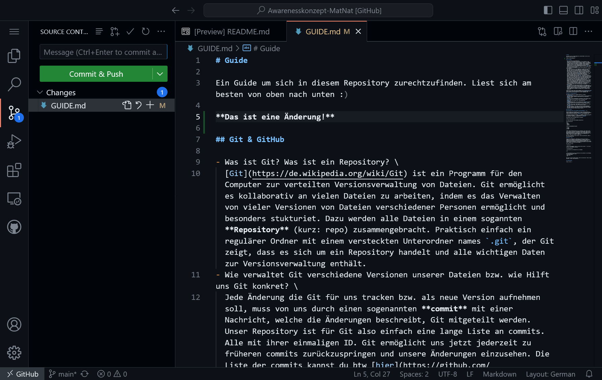
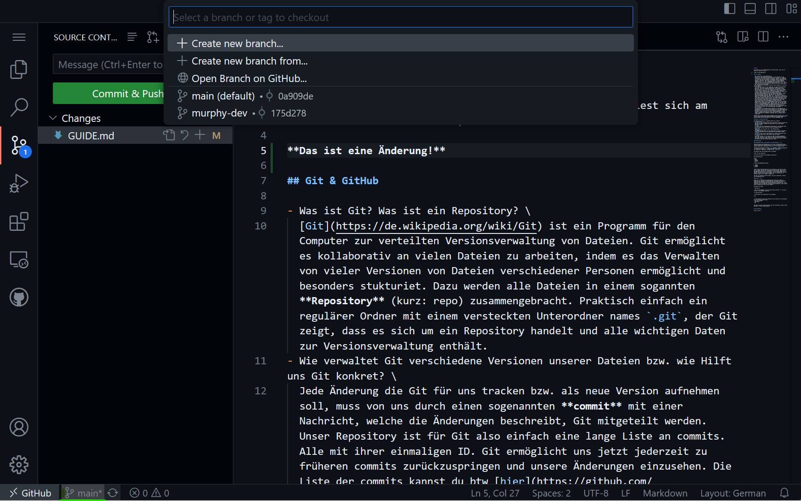
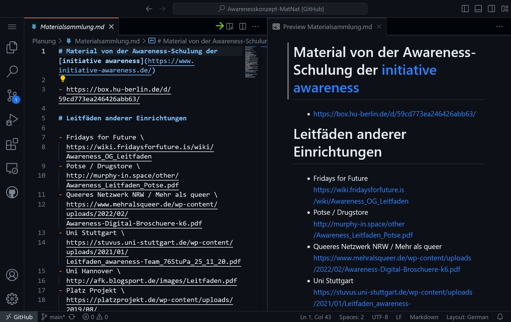

# Guide

Ein Guide um sich in diesem Repository zurechtzufinden. Liest sich am Besten von oben nach unten :)

## Git & GitHub

- Was ist Git? Was ist ein Repository? \
  [Git](https://de.wikipedia.org/wiki/Git) ist ein Programm für den Computer zur verteilten Versionsverwaltung von Dateien. Git ermöglicht es kollaborativ an vielen Dateien zu arbeiten, indem es das Verwalten von vieler Versionen von Dateien verschiedener Personen ermöglicht und besonders stukturiet. Dazu werden alle Dateien in einem sogannten **Repository** (kurz: repo) zusammengebracht. Praktisch einfach ein regulärer Ordner mit einem versteckten Unterordner names `.git`, der Git zeigt, dass es sich um ein Repository handelt und alle wichtigen Daten zur Versionsverwaltung enthält. 
- Wie verwaltet Git verschiedene Versionen unserer Dateien bzw. wie Hilft uns Git konkret? \
  Jede Änderung die Git für uns tracken bzw. als neue Version aufnehmen soll, muss von uns durch einen sogenannten **commit** mit einer Nachricht, welche die Änderungen beschreibt, Git mitgeteilt werden. Unser Repository ist für Git also einfach eine lange Liste an commits. Alle mit ihrer einmaligen ID. Git ermöglicht uns jetzt jederzeit zu früheren commits zurückzuspringen und unsere Änderungen einzusehen. Die Liste der commits kannst du btw [hier](https://github.com/Awarenessinitiative-HU/Awarenesskonzept-MatNat/commits/main) einsehen. Der zweite wichtige Punkt ist, dass wir mit Git verschiedene Entwicklungszweige (sogenannte **branches**) der Dateien erstellen können. Der Hauptzweig hat den Namen `main`. Zusätzlich zur main branch können nun alle von jedem commit nun auch eine neuen Versionsverlauf auf einer anderen branch erstellen und dort ihre eignen Änderungen in Form von commits durchführen während parallel dazu auf der main branch auch weiter gearbeitet werden kann. Sind die Änderungen der branch dann bereit in die main branch aufgenommen zu werden, können die Verzweigungen wieder zu einer zusammengefügt werden (das wird **merge** genannt). Das erfolgt dann entweder einfach direkt über Git oder über GitHub in einen sogenannten **pull request** (kurz: PR). Bei dem fragen wir bei den anderen Mitgliedern an unsere Änderungen mit in die main branch zu übernehmen und haben die Möglichkeit zu überprüfen, ob zwischen den zwei Versionen ein Konflikt ist, und die Änderungen vorher zu diskutieren und ggf. noch finale Änderungen vorzunehmen.
- Was ist GitHub?
  [GitHub](https://de.wikipedia.org/wiki/GitHub) ist eine Website bzw. eine Webapp, die Git in das Internet bringt und uns die Möglichkeit gibt gemeinsam über das Internet an einem Repository zu arbeiten. GitHub ist die Website über die du das hier liest. GitHub ermöglichen uns pull requests. Außerdem hat GitHub auch noch ein feature names **issues**. Issues ermöglichen uns Probleme, Vorschläge und co zu sammeln und zu diskutieren. 

Erkunde jetzt erstmal etwas GitHub ausgehend von der [Hauptseite des repos](https://github.com/Awarenessinitiative-HU/Awarenesskonzept-MatNat) und halte Ausschau nach all den Begriffen, die hier vorgekommen sind.

## Dateien in diesem Repository

Das Repository besteht aus folgenden Dateien bzw. Ordnern:
- `Ausarbeitungen/` \
  Ein Order mit den Ausarbeitungen unseres Konzeptes wie dem Leitfaden und dem Code of Conduct. Dateien im Typst-Format, die zu PDF Dateien gerendert werden. 
- `Planung/` \
  Ein Ordner mit den Planungsdateien zum Beispiel zu den Problemen denen wir uns widmen wollen und unseren Zielen im Markdown-Format.
- `GUIDE.md` \
  Dieser Guide, den du gerade liest. Eine Markdown-Datei. 
- `README.md` \
  Die README Markdown-Datei, die von GitHub auf der [Hauptseite](https://github.com/Awarenessinitiative-HU/Awarenesskonzept-MatNat) anzeigt. 
- `.github/` \
  Ein Order in dem ein paar Arbeitsabläufe von GitHub konfiguriert sind. Also nichts inhaltliches. Kann einfach ignoriert werden.
- `.gitignore` \
  Eine Datei, welche, für die Leute, die lokal die Dateien bearbeiten statt über den Browser, Git automatisch sagt, dass alle PDF Dateien für die commits ignoriert werden sollen. Also nichts inhaltliches, sondern technisches. Kann auch einfach ignoriert werden :)

### Dateiformate

#### [Markdown](https://de.wikipedia.org/wiki/Markdown) (`.md`)

Markdown Dateien sind Textdateien, die mit einer einfachen Syntax bzw. leicht verständlichen Zeichen angeben, wie daraus ein geredertes Dokumente erzeugt werden kann. Diese Datei (`GUIDE.md`) ist zum Beispiel eine. 

Überschriften werden durch Hashtags (`#`) angegeben. Elemente einer bullet list werden durch dashes (`-`) und nummerierte Listen durch `1.`, `2.` usw. deklariert. Hyperlinks schreiben wir mit `[text](url)`

Zum Beispiel kann eine Markdown Datei so aussehen:
```
# Das ist eine Überschrift

Ich liebe [Eis](https://de.wikipedia.org/wiki/Eis)!

Was magst du lieber? **Bold** oder _italic_ Text?

## Unterüberschrift

Ideen:
- malen
- basteln
- puzzeln

# Meine Lieblingsbäume/-pflanzen

1. Birke
2. Bambus
3. Buche
```

GitHub rendert Markdown Dateien für uns automatisch. Das siehst du hier live in action. Der Vorteil von Markdown ist aber gerade, dass auch ohne das gerenderte Resultut mit einfachem Text eine Struktur gegeben wird. Markdown Dateien benutzen wir also immer, wenn wir einfach Text schreiben wollen, ohne das wir ein schönes Ergebnis z.B. zum Drucken oder so brauchen. Super also um Ideen zu sammeln usw.

Wer mehr über Markdown erfahren möchte, kann hier weiterlesen: <https://www.markdownguide.org/>

#### Typst (`.typ`)

Typst ist ein Programm bzw. Dateiformat das ähnlich wie LaTeX uns ermöglicht aus einfachem Text PDF Dokumente zu erzeugen. Darbei benutzt Typst ähnliche Zeichen wie Markdown hat aber eben noch ganz viele Funktionen um das Dokument nach unseren belieben zu gestalten. Wir können praktisch alles frei gestalten. Wie genau das funktioniert, musst du nicht wissen. @Murphy kann sich um alles kümmern :) 

Die Syntax von Typst:
```
= Überschrift

// Das ist ein Kommentar. Alles in dieser Zeile nach dem '//' wird nicht am Ende in dem Dokument auftauchen.

== Unterüberschrift

// Eine bullet list funktioniert wie in Markdown
- a
- b
- c

// Eine nummerierte Liste ist tatsächlich noch einfacher als bei Markdown. Wir müssen nicht selber zählen!
+ Das erste Element
+ Das zweite
+ Das
+
```

Wer mehr über Typst erfahren möchte, kann hier weiterlesen: <https://typst.app/home>, <https://typst.app/docs/>

## Arbeitsabläufe

Es gibt zwei Möglichkeiten die Dateien zu bearbeiten. Entweder direkt hier im Browser ohne etwas installieren zu müssen oder lokal auf dem eigenen Computer (damit auch offline möglich).

### Im Browser bearbeiten

<https://github.dev/Awarenessinitiative-HU/Awarenesskonzept-MatNat/blob/main/>








### Lokal bearbeiten

Um lokal an den Dateien zu arbeiten, werden ein paar Sachen benötigt:

- Git installiert und das Wissen, wie man Git bedient.
- Ein Text-Editor um die Dateien zu bearbeiten (z.B. Visual Studio Code).
- Eventuell GitHub Desktop um das Arbeiten mit Git leichter zu machen.

### Allgemein


#### Pull request

<https://github.com/Awarenessinitiative-HU/Awarenesskonzept-MatNat/compare/>


#### Workflows

Gerenderte Dateien zu jedem commit.
<https://github.com/Awarenessinitiative-HU/Awarenesskonzept-MatNat/actions/>

#### Veröffentlichungen (Releases)

<https://github.com/Awarenessinitiative-HU/Awarenesskonzept-MatNat/releases>
